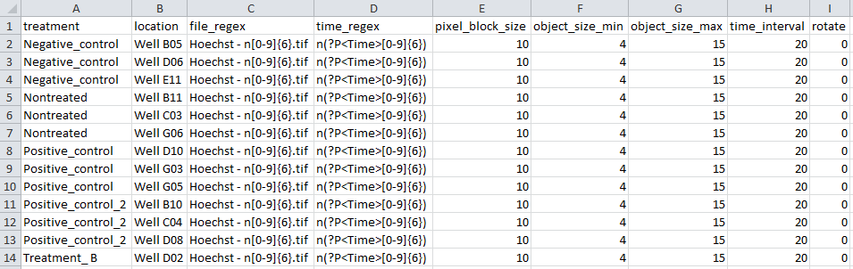

# Plate Zip and Index file

The plate zip and index file are the inputs needed to run KREAP.  

## Plate ZIP  

Create a folder with every well you want to be included in your analysis:  
 
  
Create a new zip of these folders:  
  
  
The newly created zip is one of the two inputs for KREAP:  
  

## Index  

The index file has the following structure:  
  
| Column Name      | Description                                                               |
|------------------|---------------------------------------------------------------------------|
| treatment        | The treatment group                                                       |
| location         | Location of the well (relative in the zip)                                |
| file_regex       | A regular expression that helps ignore other (irrelevant) files in a well |
| time_regex       | A regular expression that selects the time point of an image              |
| pixel_block_size | The pixel block size parameter for Cellprofiler                           |
| object_size_min  | The minimum object size (in pixels)                                       |
| object_size_max  | The maximum object size (in pixels)                                       |
| time_interval    | The time (in minutes) between images                                      |
  
Here is the index file associated with the zip created in the previous section:  
  
  
The index file doesn't have to be created in Excel, but it's convenient.  
Any other program that can output tabular files should also work (including any regular text editors).  

## Note
  
It's possible to create zip and index file that contain multiple plates by using extra directories in the zip and index file:  
  
  
# Analyse your data with KREAP  
  
[Uploading file to Galaxy KREAP](use_kreap_upload)  
[Run KREAP Image Analysis](use_kreap_analysis)  
[Run KREAP Data Modeling](use_kreap_modeling)  
[Handling errors in the modeling result](use_kreap_model_error)