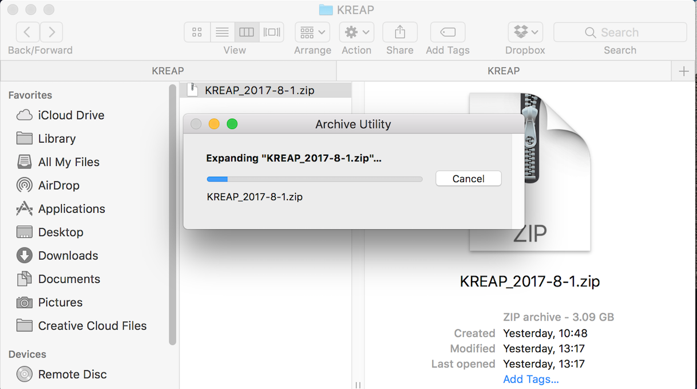
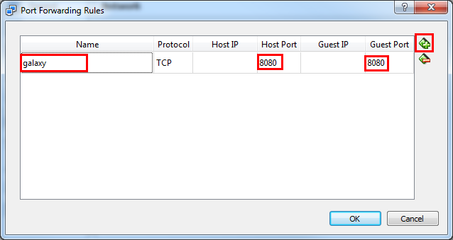

# Download the KREAP VM

Download the [KREAP](https://bioinf-galaxian.erasmusmc.nl/owncloud/index.php/s/orwOcp2gigftAtw/download) VM.

## Extract the zip

The downloaded file is a zip archive, which has to be unpacked.  

### Windows

Unpack the zip with an archiving tool, 7-zip is used here, but use what ever is available:  
  

### Mac

Unpack the zip by double clicking it:  
  

### Linux

With the many flavours of Linux, it's difficult to cover every one of them, but most come with support for many different types of archives.  
Here is an example of what it would look like in Kubuntu:  
  

## Import KREAP into VirtualBox  

Open VirtualBox and click on "New" (top left), fill in a name for the VM, select Linux as a "Type" and "Ubuntu (64-bit)" as Version and click "Next":
  
  
Select the ammount of memory that should be available to KREAP, at least 4096MB is recommended, but KREAP should still run with less.  
It is recommended to stay within the suggested (green) area, this is dependent on the computer that VirtualBox is installed on:  
  
  
Select "Use an existing virtual hard disk file" and click on the "Choose a virtual hard disk file..." button:
  
  
Navigate to the unpacked KREAP VM and open it:  
  

Click on create:  
  
  
You will be back at the main VirtualBox screen, but now with the KREAP VM added:  
  
  
Right click on the newly created KREAP VM and select "Settings":  
  
  
In the settings of the KREAP VM, select "Network", click "advanced" and then "Port Forwarding":  
  
  
Click on the green "+" icon on the right side of the window, fill in a name for the new rule and "8080" for the "Host Port" and "8080" for the "Guest Port":  
  
  
Now it's finally time to start the KREAP VM, Click "OK" to accept the new Port forwarding rule and "OK" again to accept the new settings.  
Select the newly created KREAP entry and click on "Start" (green arrow) at the top, after a while you will see the following screen:  
  

Open up your favourite webbrowser and go to [127.0.0.1:8080](http://127.0.0.1:8080), you should see the KREAP Galaxy main page:  
 

# Create a Plate zip and index  
  
Learn more about the Plate zip and index file that are used as inputs for KREAP [here](file_formats)