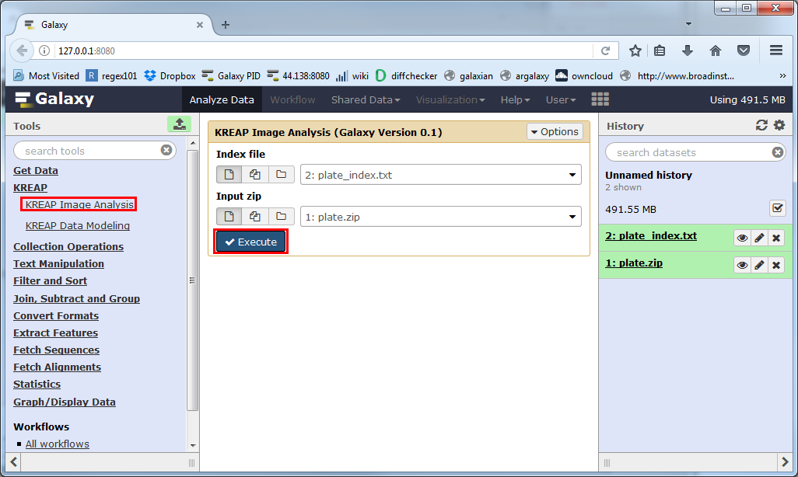
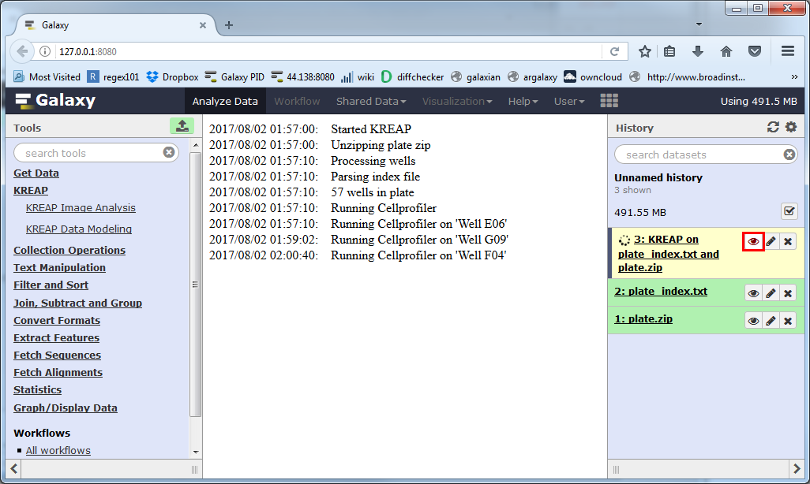
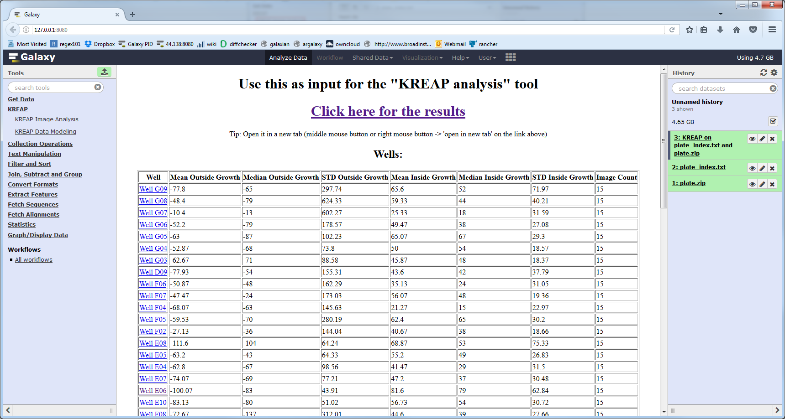
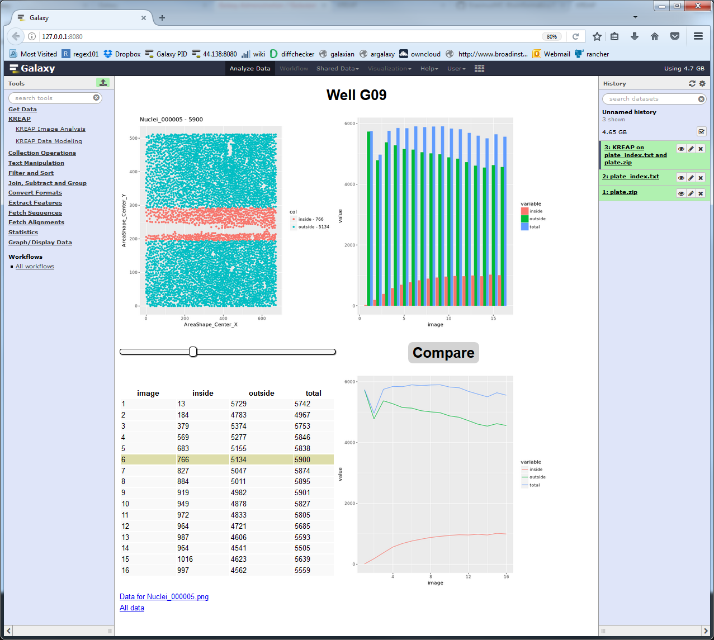
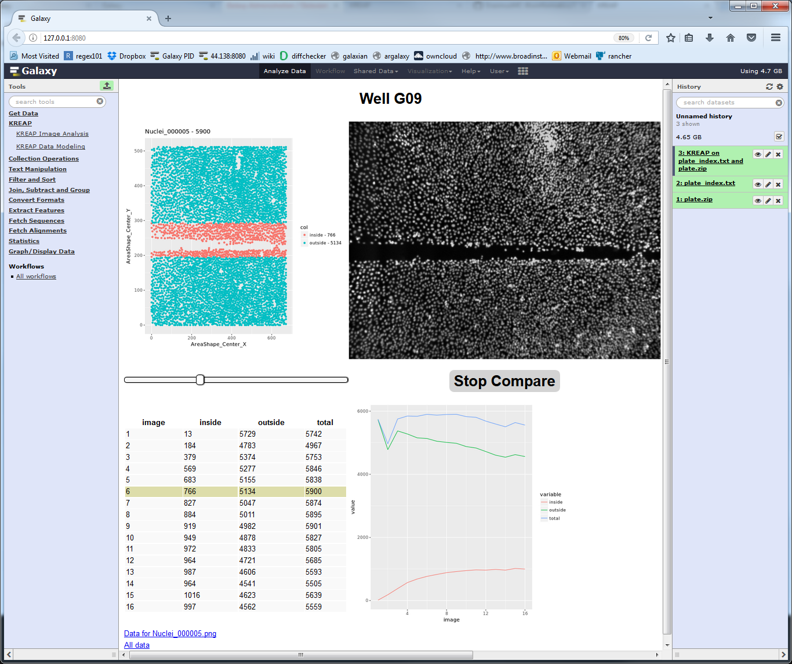

# Run KREAP Image Analysis  

Select "KREAP Image Analysis" on the left side of Galaxy, you might have to click on the "KREAP" header to expand the subsection.  
Make sure the "Index file" paremeter and the "Input zip" parameter are both using the right datasets in your history and click on "Execute":
  
  
A new dataset will be created in your history, which will hold the result of the "KREAP Image Analysis".  
The yellow color means that it's still working on something, you can click on the eye symbol to see the progress of the analysis.  
Depending on the number of wells and number of time points per well it might take anywhere from minutes to hours to complete:  
  

The dataset will turn green when it's finished, you can then click on the eye again to view the result:  
  

Clicking on one of the wells shows the raw stats collected from a well:
  

Clicking on the "Compare" button gives the raw input image as a comparison so that the cell detection can be checked:  
  

Continue to the guide on how to use [KREAP Data Modeling](use_kreap_modeling)