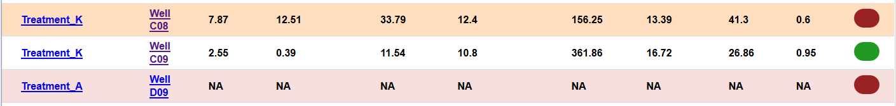
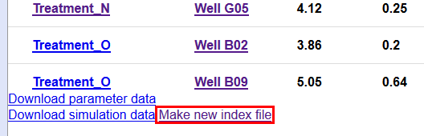
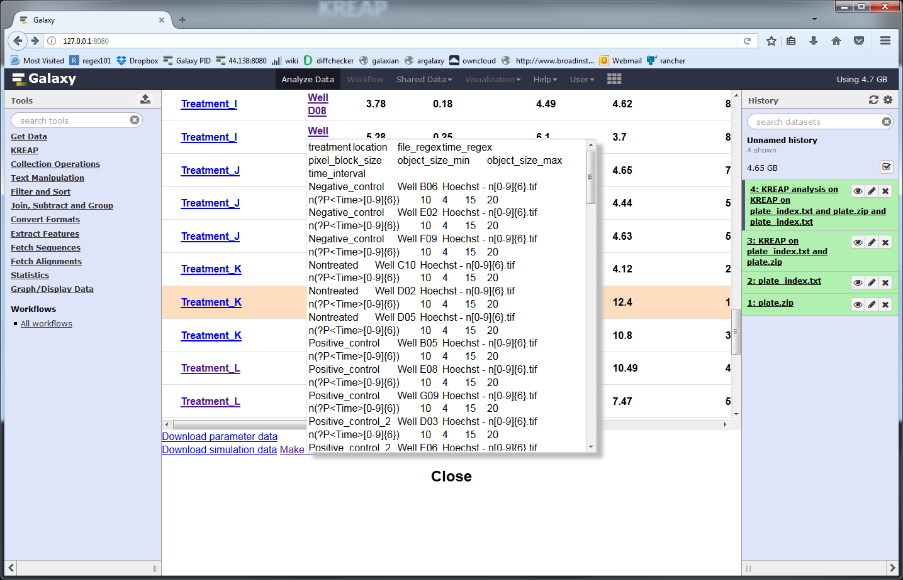
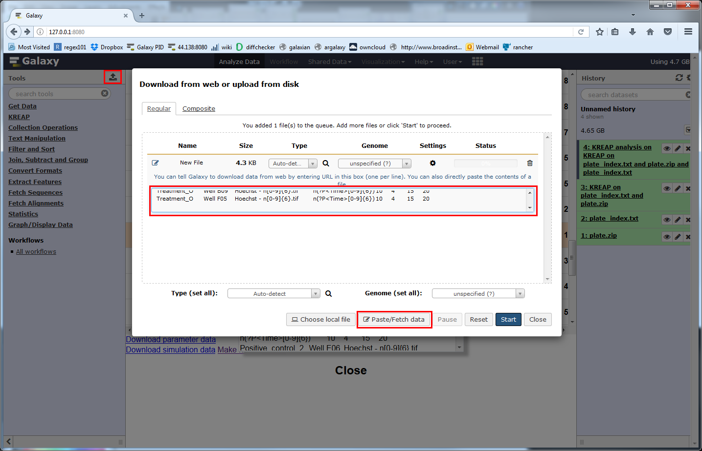
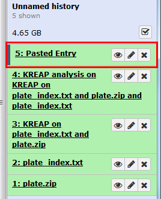
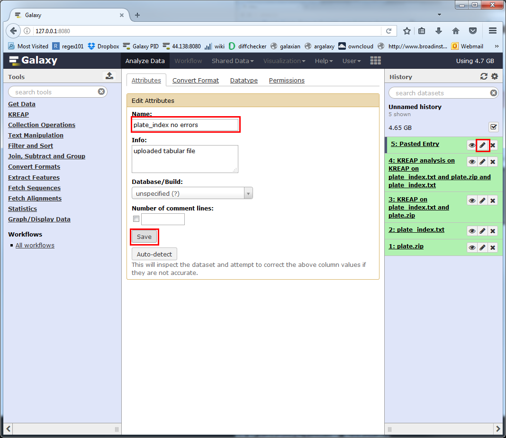
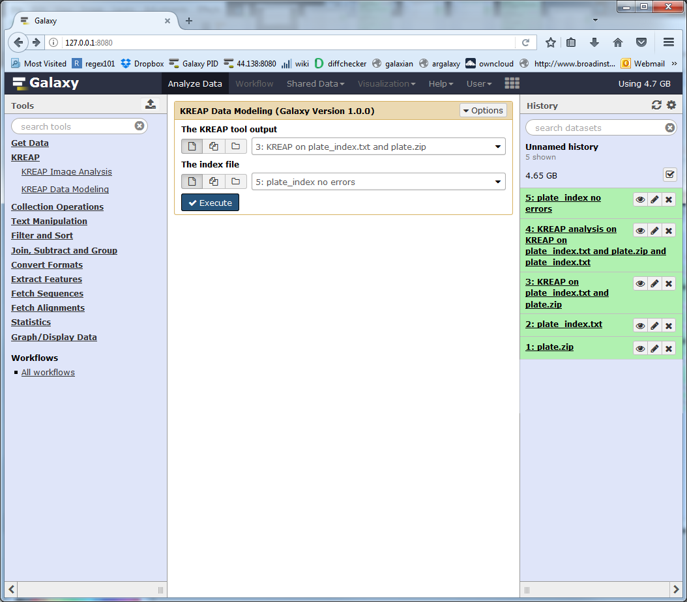
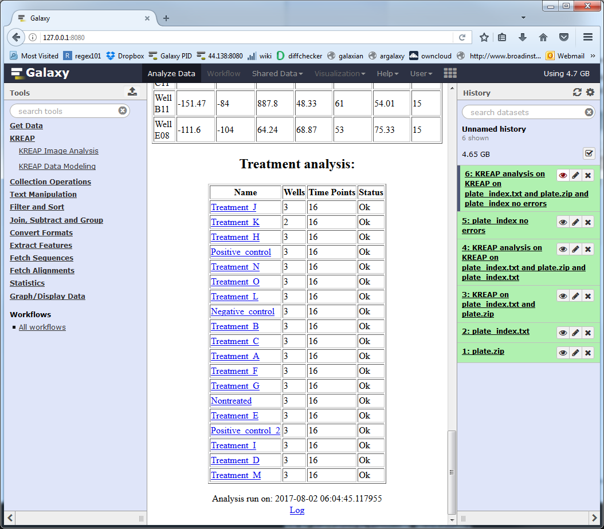

# Errors in the modeling result

It is possible that some of the wells couldn't be modeled:  
  

When this happens, we've provided an easy way to exclude these wells from the modeling process.  
By unchecking the 'Include' column, it will be excluded when generating a new index file.  
The wells that couldn't be modeled or have an error will be automatically excluded.  
When ready, click on the "Make new index file" link at the bottom of the page:  
  

A new popup with the new index file will show:  
  

Copy all of the text from the popup and click on the Galaxy upload button, then on the "Paste/Fetch data" and paste the new index file into the textbox:  
  

Click on "Start" to create the new index file in your history, ready to use:  
  

The default name Galaxy gives our new index file isn't that self explanatory, we can change it by clicking on the pencil, filling in a new name and saving it:  
  

Rerunning "KREAP Data Modeling" with the new index file works the exact same way.  
Make sure the "KREAP tool output" points to the "KREAP Image Analysis" output and not the previous "KREAP Data Modeling" output:  
  

Now none of the treatments have an "Error!" status:  
  