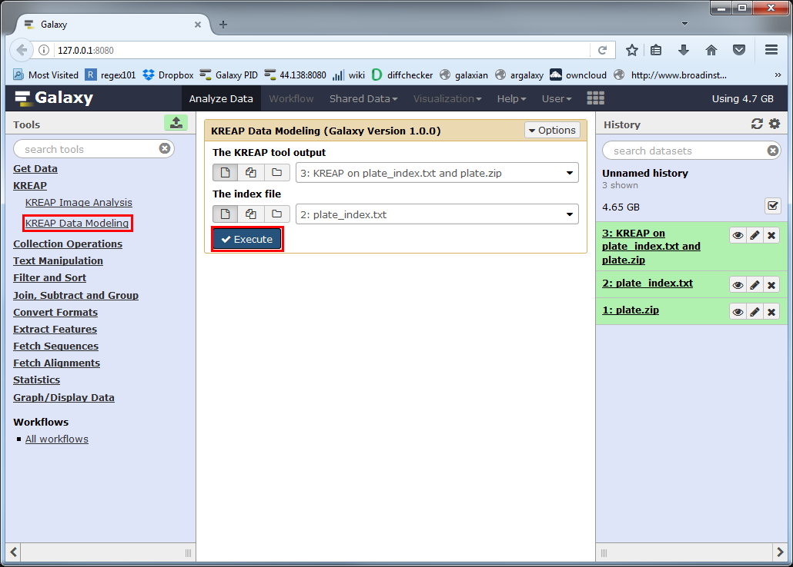
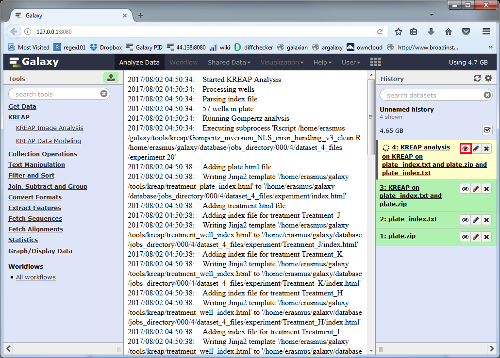
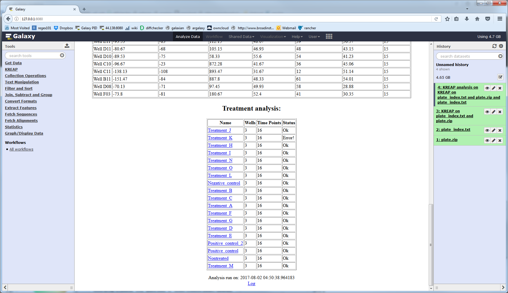
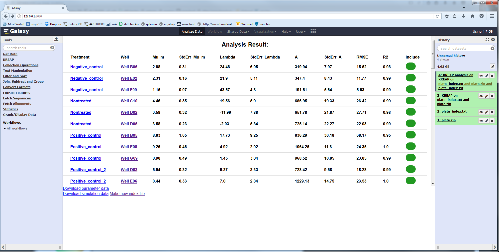
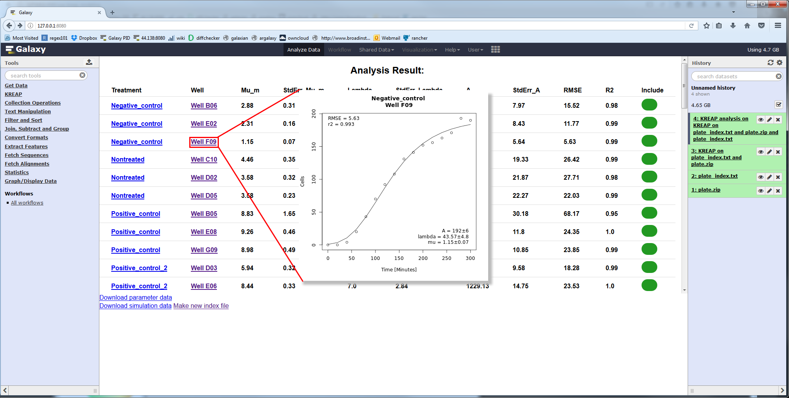

# Run KREAP Data Modeling

Select the "KREAP Data Modeling" tool from the right side in Galaxy.  
The "KREAP tool output" parameter must point to the output of the "KREAP Image Analysis" tool.  
The "index file" parameter must point to an associated index file.  
Click on Execute to run "KREAP Data Modeling":  
  
  
A new dataset will be created in your history, which will hold the result of the "KREAP Data Modeling".  
The yellow color means that it's still working on something, you can click on the eye symbol to see the progress of the analysis:  
  
  
At first sight, the result looks the same as the output from "KREAP Image Analysis", but when you scroll down you see the result "KREAP Data Modeling" has been added to the page.  
If one of the wells in a treatment couldn't be modeled, it will have an "Error!" status:  
  

If you click on the "Click here for the results" link at the top of the result page you will be taken to a page that shows the results of modeling the wells:  
  
  
The values are:  

| Column Name   | Description                                                      |
|---------------|------------------------------------------------------------------|
| Treatment     | Name of the treatment added to the well                          |
| Well          | The well                                                         |
| Mu_m          | Repair rate (cells/minute)                                       |
| StdErr_Mu_m   | Standard error from the mean, Mu_m parameter                     |
| Lambda        | Lag time or inflection point (minutes)                           |
| StdErr_Lambda | Standard error from the mean, Lambda parameter                   |
| A             | Maximum number of cells in the scratched area (cells)            |
| StdErr_A      | Standard error from the mean, A parameter                        |
| RMSE          | Root-mean-square error                                           |
| R2            | Goodness of fit                                                  |
| Include       | Should this well be included in a the newly generated index file |
  
Clicking on a well will show you the measured and modeled data in a graph:  
  

Continue to the guide on how to deal with [errors in the modeling result](use_kreap_model_error).