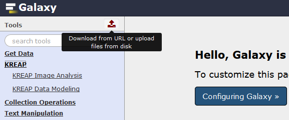
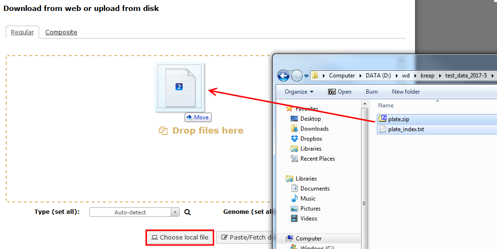
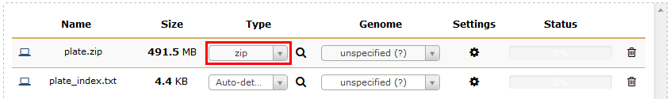
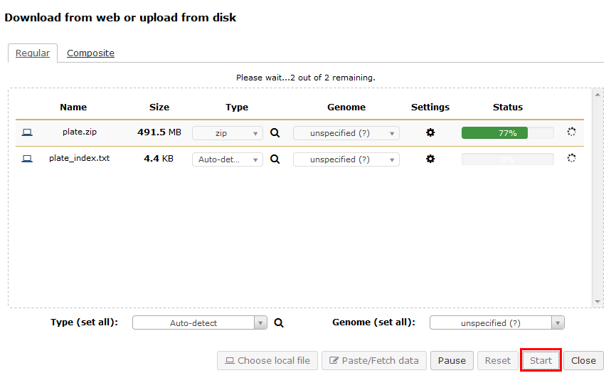
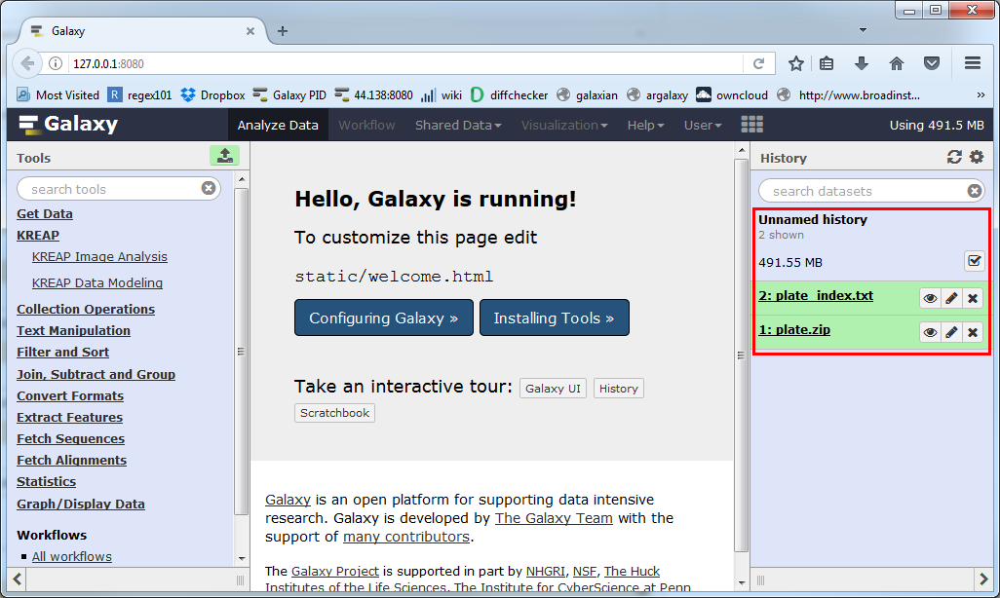

# Upload your data to Galaxy

Click on the "Upload" button at the top left of Galaxy:
 
  
You can either click on the "Choose local file" button to select your files or drag and drop your files into the designated area from your file browser:  
  
  
Make sure that the "type" of the zip is set to "zip":  
  
  
Click on the "Start" button and it will upload your files to Galaxy:  
  
  
When the upload is completed the files will be available in your history (right side of Galaxy):  
  

Continue to the guide on how to use [KREAP Image Analysis](use_kreap_analysis)