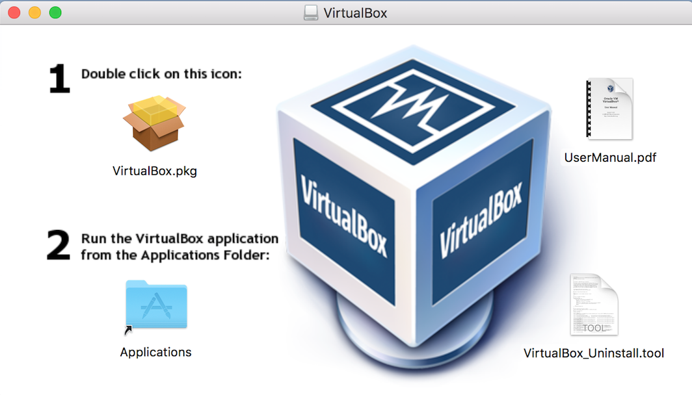
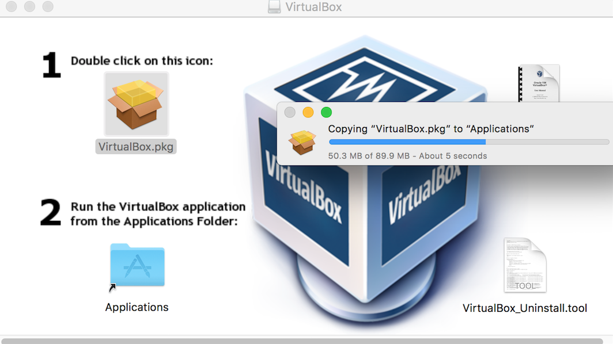
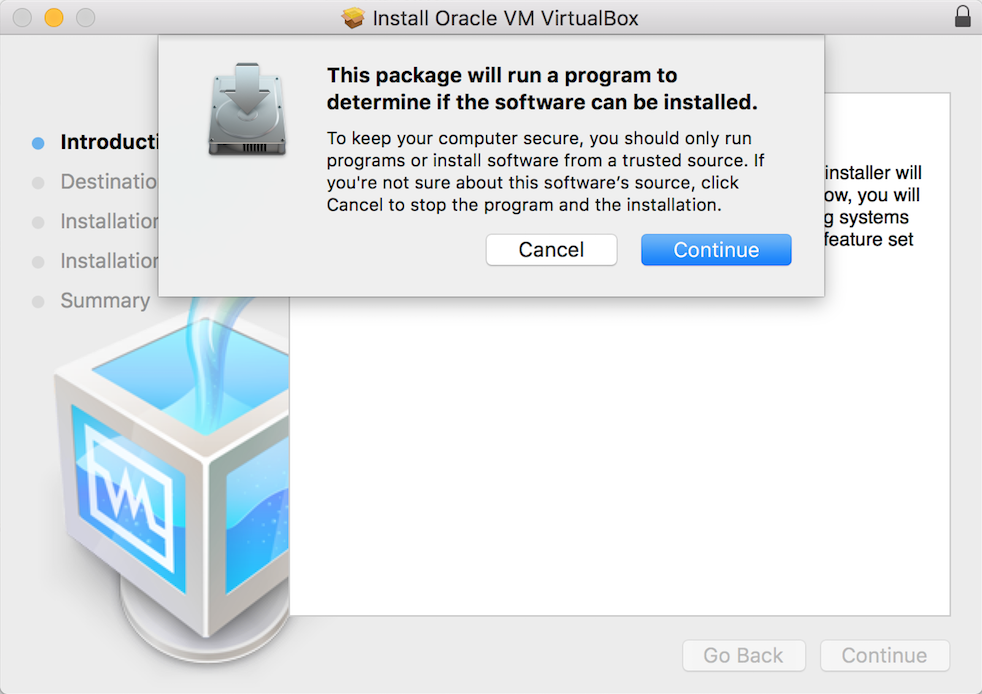
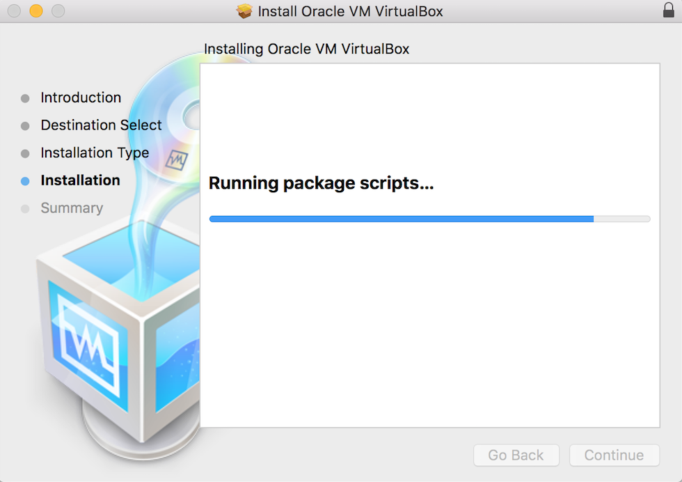
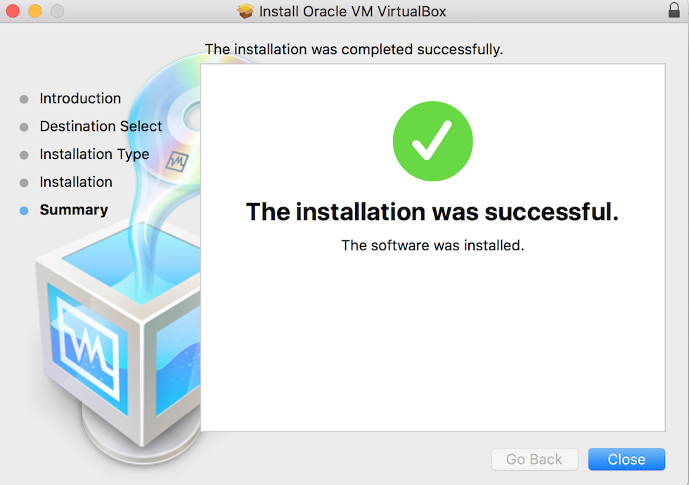
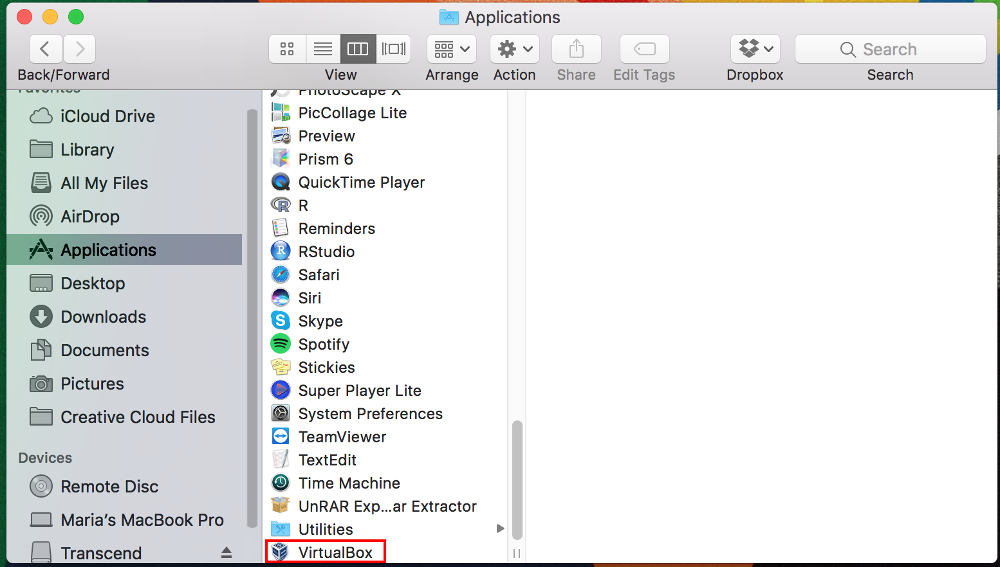

# Download Virtual Box

Download [Oracle Virtual Box](http://download.virtualbox.org/virtualbox/5.1.26/VirtualBox-5.1.26-117224-OSX.dmg) for mac.

## Install Virtual Box

Open the downloaded file:
  
  
Double clicking the "Virtualbox.pkg" icon will start the installation:
  
  
Confirm that you want to install VirtualBox by clicking on "Continue":
  
  
VirtualBox will now be installed:
  
  
Click on "Close" to quit the installer when the installation is succesful:
  

You can now find VirtualBox with the rest of your installed applications:  
  

### Setup KREAP

Once you've installed Virtual Box, continue to the [guide](setup_kreap) on how to setup the KREAP VM.