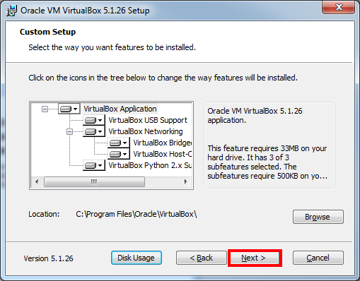
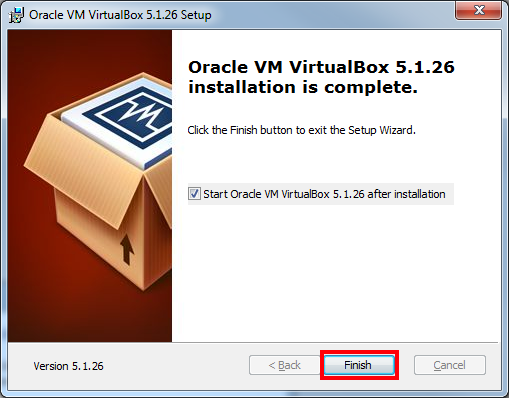

# Download Virtual Box

Download [Oracle Virtual Box](http://download.virtualbox.org/virtualbox/5.1.26/VirtualBox-5.1.26-117224-Win.exe) for mac.

## Install Virtual Box

Click "Next" on the first windows:
  
  
The defaults on the next page are fine most of the time but can be changed if necessary.  
Click "Next" again:  
  
  
Select the features you want to enable and click "Next":  
  
  
During the installation your internet connection will be disconnected briefly, make sure you don't have any running downloads and click "Yes":
  
  
Click "Install":  
 
  
During installation, you will be prompted to install additional drivers, click "Install" to continue:
  

Click on "Finish" to complete the installation process:  
  

### Setup KREAP

Once you've installed Virtual Box, continue to the [guide](setup_kreap) on how to setup the KREAP VM.